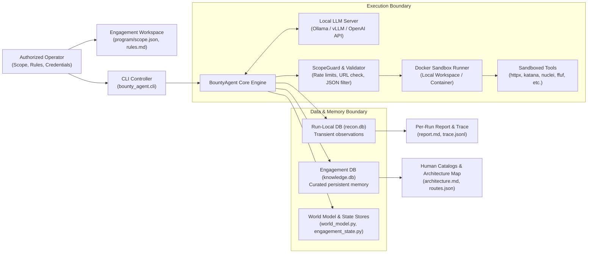
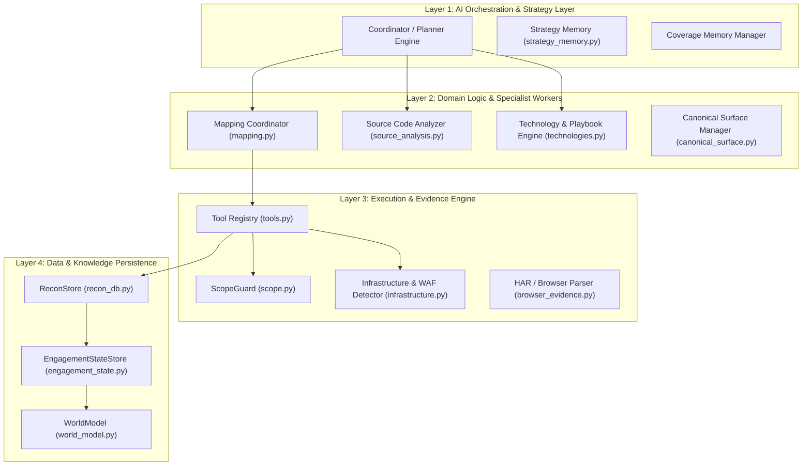
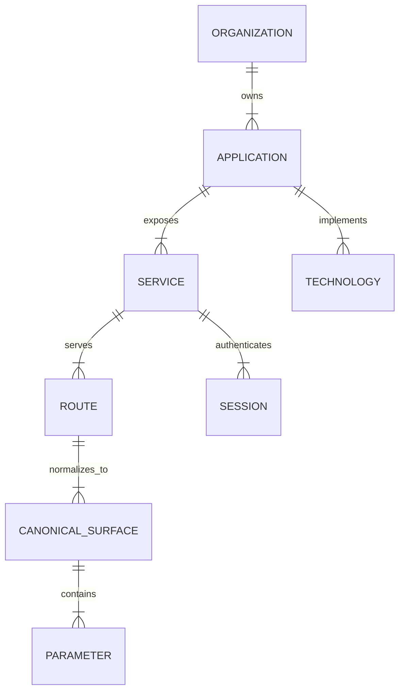
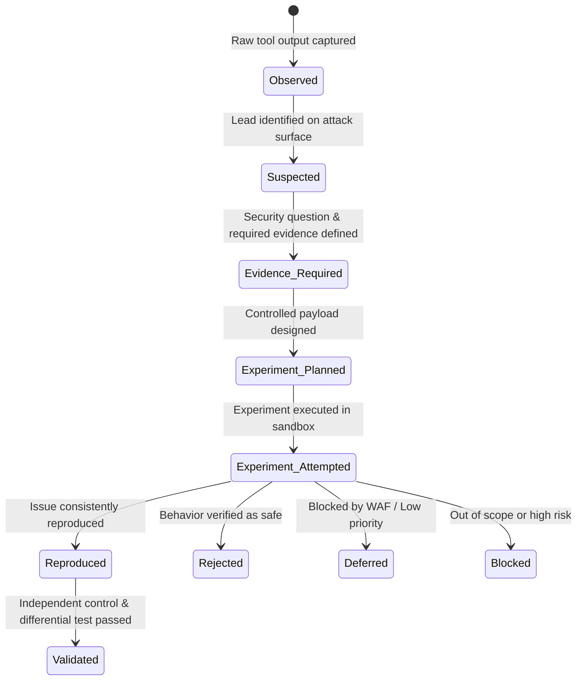
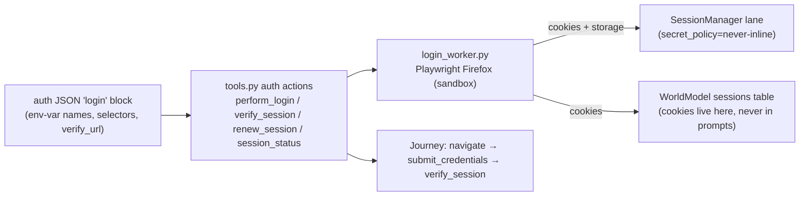

# ChainsawRecon Architecture & Internal Engineering Specifications

## 1. Overview & System Purpose

**ChainsawRecon** is an autonomous, stateful AI penetration testing and security assessment framework. It orchestrates security tools inside an isolated Docker sandbox, builds a stateful world model of target applications, and executes hypothesis-driven experiments with concrete evidence validation.

Unlike stateless scanner wrappers or prompt-driven script generators, ChainsawRecon separates **reasoning**, **state management**, **tool execution**, and **evidence verification** into decoupled architectural layers.

---

## 2. System Context & Trust Architecture



### Trust Boundaries & Isolation

| Layer | Component | Execution / Trust Boundary | Responsibility |
|---|---|---|---|
| **Control** | Operator & CLI | Host Environment | Defines authorization, target scope, resource ceilings, and execution mode. |
| **Reasoning** | Local LLM | API Interface Only | Proposes next structured JSON actions based on compact context. Has **zero shell access**. |
| **Validation** | ScopeGuard | Host Application Logic | Intercepts and validates every target domain, rate limit, and command syntax before execution. |
| **Execution** | Sandbox Container | Isolated Docker Runtime | Runs security tools (`httpx`, `katana`, `ffuf`, `dalfox`) inside a dropped-capability container. |
| **Storage** | SQLite Data Stores | Local Disk Workspace | Maintains durable target topology, session tokens, evidence hashes, and audit traces. |

---

## 3. High-Level System Architecture & Layered Decomposition

ChainsawRecon is structured into four primary operating layers:



---

## 4. Code-Level Codebase Architecture & File Mapping

The core logic of ChainsawRecon resides within the `bounty_agent` Python package:

```text
bounty_agent/
├── agent.py                 # Core BountyAgent execution loop & lifecycle coordinator
├── cli.py                   # Command-line entry point and argument parser
├── world_model.py           # SQLite relational topology (Apps, Services, Routes, Sessions)
├── engagement_state.py      # Objective state machine, Hypotheses, Evidence, and Actions
├── recon_db.py              # Low-level SQLite store for tool observations and facts
├── canonical_surface.py     # Canonical surface normalization and deduplication
├── scope.py                 # ScopeGuard rule validator and rate limiter
├── tools.py                 # ToolRegistry, sandboxed execution, and output parsers
├── sandbox.py               # Docker container runner and execution isolation
├── infrastructure.py        # WAF/CDN detector and back-off strategy manager
├── strategy_memory.py       # Loop detection and strategy memory tracker
├── source_analysis.py       # Static source-code parsing (Flask, Express, fetch endpoints)
├── browser_evidence.py      # HAR traffic parser, cookie extractor, and session recorder
├── technologies.py          # Tech stack detector and vulnerability playbook mapper
├── mapping.py               # Target mapping coordinator and seed planner
├── prompts.py               # System prompts, recon plans, and instruction builders
├── llm.py                   # OpenAI-compatible LLM client wrapper (Ollama/vLLM)
├── workers.py               # Specialist worker contracts + hard-block exec gate
├── surface_router.py        # Fingerprinting router: surface → specialist lane ladder
├── nuclei.py                # Typed nuclei action: scope check, JSONL parse, evidence
├── session_manager.py       # Session lane lifecycle (pending→active→stale→expired)
├── auth_pipeline.py         # LoginSpec loading, secret-free payloads, cookie merging
├── login_worker.py          # Playwright Firefox login worker script (deterministic)
├── journeys.py              # Browser journey store: steps, request lineage, mutations
├── burp_mcp/                # Verified PortSwigger MCP adapter
│   ├── client.py            #   JSON-RPC client, entry resolution by synthesized id
│   ├── parsing.py           #   Real wire format: \n\n-joined, truncation-tolerant
│   ├── schema.py            #   Tool catalog + capability discovery
│   └── actions.py           #   Semantic actions (search/get/replay/compare/repeater)
└── report.md                # Automated Markdown catalog and report generators
```

---

## 5. End-to-End Execution Flow (Code-Level Step-by-Step)

When `python -m bounty_agent.cli` is executed, the framework executes the following step-by-step pipeline:

```mermaid
sequenceDiagram
    autonumber
    participant CLI as cli.py
    participant Agent as agent.py (BountyAgent)
    participant Scope as scope.py (ScopeGuard)
    participant LLM as llm.py (LLMClient)
    participant Tools as tools.py (ToolRegistry)
    participant Box as sandbox.py (DockerRunner)
    participant State as engagement_state.py & world_model.py

    CLI->>Agent: Instantiate BountyAgent(scope, target, settings)
    Agent->>State: Initialize ReconStore, WorldModel, EngagementStateStore
    Agent->>Tools: Initialize ToolRegistry with ScopeGuard & SandboxRunner

    loop Target Queue Processing
        Agent->>Scope: Validate Target URL against scope.json
        alt Target Allowed
            Agent->>Agent: Build compact LLM context (Prompts, World Model, Gaps)
            Agent->>LLM: Complete(prompt_messages)
            LLM-->>Agent: Returns JSON Action (e.g. run_tool, bash, finish)
            Agent->>Tools: Execute(action)
            Tools->>Scope: Validate command targets & flags
            Tools->>Box: Run command inside Docker container
            Box-->>Tools: Return stdout, stderr, exit_code
            Tools->>State: Ingest raw observation & update InfrastructureStore
            State->>State: Normalize surface & update CanonicalSurfaceManager
            Agent->>State: Record Action, Hypothesis, or Evidence record
        else Target Blocked
            Agent->>Agent: Log target blocking & proceed to next queue entry
        end
    end

    Agent->>State: Promote run facts to engagement memory (knowledge.db)
    Agent->>State: Export catalogs (architecture.md, routes.json, world-model.json)
```

---

## 6. Core Subsystems & Deep Dive

### 6.1 Persistent World Model (`world_model.py`)
Rather than relying on flat lists of endpoints, the **World Model** maintains a relational graph in SQLite representing the target application topology:



Entities managed inside SQLite:
* `Organization`: Parent entity/domain holder.
* `Application`: Framework, language, frontend, WAF/CDN, auth provider.
* `Service`: Host, port, TLS state, service type.
* `Route`: Host, path, method (`GET`/`POST`), auth requirement state.
* `Technology`: Detected software, version, confidence level, attack playbooks.
* `Session`: Cookies, JWT tokens, issuer, subject, role, tenant, SameSite flags, browser-only status.

### 6.2 Objective & Hypothesis Lifecycle (`engagement_state.py`)
To prevent infinite scanner loops and raw prompt guessing, every potential vulnerability follows a rigorous state machine:



Every hypothesis requires:
1. **Security Question** (e.g., *"Can User A read User B's invoice at `/api/v1/invoices/102`?"*)
2. **Affected Surface** (`Route` / `Endpoint`)
3. **Suspected Vulnerability Class** (`IDOR`, `BOLA`, `JWT_Bypass`, `GraphQL_Auth`)
4. **Required Evidence** (Request/Response pair, status code diff, token comparison)

### 6.3 Canonical Surface Management (`canonical_surface.py`)
Modern web applications expose duplicate URLs representing the exact same backend logic (e.g., `/item/1` vs `/item/2` or Cloudflare token variations). The `CanonicalSurfaceManager`:
* Strips tracking parameters, session tokens, and cache-busters.
* Replaces dynamic path segments (`/users/1234/profile` $\rightarrow$ `/users/{id}/profile`).
* Deduplicates target queues so the agent evaluates **unique attack surfaces** rather than redundant URLs.

### 6.4 Infrastructure & WAF Awareness (`infrastructure.py`)
When an outbound tool receives a `403 Forbidden`, `429 Too Many Requests`, or Cloudflare Challenge page:
* `InfrastructureStore` records WAF flags (`Cloudflare`, `Akamai`, `AWS WAF`).
* The system enforces **back-off delays** and lowers request rates.
* Rather than attempting brute-force bypasses, the surface state transitions to `deferred` or `blocked`, preserving execution budget.

### 6.5 Source Code & Client-Artifact Analysis (`source_analysis.py` & `browser_evidence.py`)
* **Static Analysis:** Reads local source repositories to extract Flask/Express/Rails routes, hidden API endpoints, and authentication middleware.
* **Browser Capture (HAR):** Imports HAR files recorded during browser sessions, extracts network requests, parses JWT/cookie attributes, and builds replayable HTTP session objects.

---

## 7. Data Models: Run Database vs. Engagement Knowledge

ChainsawRecon implements a strict **two-tier memory architecture**:

```text
[ Raw Tool Execution ]
         │
         ▼
 ┌───────────────────────────┐
 │   Run Store (recon.db)    │  <-- Disposable snapshot per session
 │  (All raw observations)   │      Holds noisy/tentative data
 └─────────────┬─────────────┘
               │
      [ Promotion Filter ]  <-- Only verified, in-scope, high-confidence facts
               │
               ▼
 ┌───────────────────────────┐
 │ Engagement (knowledge.db) │  <-- Durable cross-run memory
 │  (Curated target graph)   │      Powers architecture.md & catalogs
 └───────────────────────────┘
```

1. **`recon.db` (Run Database):** Disposable database instantiated for a single execution session. Stores raw tool outputs, temporary logs, and transient observations.
2. **`knowledge.db` (Engagement Database):** Permanent, curated database across all runs of an engagement. Only high-confidence, verified facts (live hosts, endpoints, technology playbooks, validated findings) are promoted into `knowledge.db`.

---

## 7b. Deterministic Hunt Engine & Tradecraft (M2/M3)

Two milestone layers harden the reasoning loop so the model stops producing garbage findings and starts applying real tradecraft.

### Deterministic Hunt Engine (M2)

| Module | File | Responsibility |
|---|---|---|
| Tool-first policy | `tools.py` | `recommended_tool_for_surface()` maps surface type → deterministic tool; `is_bulk_python_scan()` bans the "100-endpoint Python loop" anti-pattern. |
| Endpoint exhaustion | `endpoint_tracker.py` | `EndpointExhaustionTracker` counts negative outcomes per (host,path); after 3 repeated 403/404/auth-gate it injects `ENDPOINT EXHAUSTED` and prunes the endpoint from the active queue. |
| Auth-gate awareness | `endpoint_tracker.py` | `AuthGateClassifier` classifies login walls / `sign_in_required` as `auth_gate` — never `interesting` or `confirmed`. |
| 7-Question Gate | `tools.py` | `evaluate_finding_7q()` replaces heuristic rung classification with a structured gate: in-scope, reproducible, real impact, not auth-gate, business relevance, VRT severity, POE complete. |

### Knowledge & Tradecraft (M3)

| Module | File | Responsibility |
|---|---|---|
| Tradecraft skill packs | `skills.py` | Per-vuln-class `AgentSkill`s: `ssrf_tester`, `xss_tester`, `sqli_tester`, `file_upload_tester`, `oauth_tester`, `race_tester`, plus existing IDOR/JWT/session packs. |
| GraphQL authz pack | `skills.py` | `graphql_authz`: field-level authz, batching/alias bypass, mutation-authz, introspection leakage. |
| Report-writing skill | `skills.py` | `report_writing`: VRT-aware severity, impact-first framing, POE completeness, platform templates. |
| Deterministic research | `research.py` | OSV API (keyless CVE lookup) + Tavily JSON search; exposed as the `research` tool action. Never scrapes HTML. |
| Recon-aware auto-selection | `agent.py` | `_build_auto_skill_prompt()` maps discovered surfaces → skill packs and injects them into `_prepare_llm_messages`; no `use_skill` call needed. |

**Tavily key:** `TAVILY_API_KEY` lives in the root `.env` (loaded by `cli.py` via `load_env_file`). Without it, Tavily returns a clear "unavailable" message and the agent falls back to the keyless OSV API.

---

## 7c. Harness Upgrades (2026-09 Series)

Post-M3 upgrades that move ChainsawRecon from agent loop toward a full bug-hunting **harness**. Full research/audit record: `tests/researched_improvements/updates-implemented.md`.

### 7c.1 Verified Burp MCP Adapter (`burp_mcp/`)

The adapter is verified against the live PortSwigger `mcp-server` extension source:

* **Real wire format:** proxy history arrives as `\n\n`-joined serialized items (`{request, response, notes}`, **no id**), each truncated at 5000 chars with a `... (truncated)` marker. `parsing._split_history_blob` tracks JSON brace depth across blank lines and treats the truncation marker as an item terminator; unparseable items survive as raw text.
* **Synthesized ids:** entries get `id = "<page-index>-<sha1(request-line)[:8]>"`, prefixed into summaries as `[id]`. `client._find_entry` resolves full ids, bare page indexes, or hash suffixes — making search → get → replay → compare → Repeater workflows functional against the real extension.
* **Catalog:** tool names match the extension's `toLowerSnakeCase()` registrations; default endpoint `http://127.0.0.1:9876`.

### 7c.2 Session Lanes & Playwright Auth Pipeline



* **Secret hygiene:** the spec names *environment variables* (`CHAINSAW_AUTH_USERNAME`/`CHAINSAW_AUTH_PASSWORD` by default). Secret values never enter spec files, argv, traces, prompts, or artifacts.
* **Lane partitioning:** sessions are keyed by the stable engagement id `stable_id("engagement", db_parent, program_name)` — shared across runs of the same program. `_find_session` resolves alias collisions by preferring active/verified, then freshest verification.
* **Renewal:** `renew_session` marks the lane stale, re-runs the login, and merges operator-maintained cookies (`maintain_cookies`, e.g. `remember_me`) that the fresh capture did not re-issue.
* **Verify-only lane:** operator-supplied cookie groups are injected and checked against `verify_url` without performing a login.
* **Subdomain coverage:** a lane covers only the cookie domains the target set; sessionless in-scope subdomains stay on the unauthenticated mapping lane.

### 7c.3 Worker Hard-Block Gate, Nuclei Action, Surface Router

| Module | Responsibility |
|---|---|
| `workers.py` | Worker action contracts enforced at dispatch: an action outside the active worker's `allowed_actions` is **hard-blocked** with an error naming the allowed set. `WORKER_META_ACTIONS` (finish, record_*, auth actions, …) always pass. |
| `nuclei.py` | Typed `nuclei` action: scope-validated, JSONL output parsing, severity filtering, structured evidence records. |
| `surface_router.py` | Fingerprints a surface and returns an ordered specialist-lane **fallback ladder** with burned-rung memory (a failed lane is not retried on that surface). |

### 7c.4 World-Model Asset Staleness

Enterprise ASM pattern (first_seen/last_seen): `services`, `world_routes`, and `technologies` carry a `last_seen` column (idempotent migration in `recon_db.ensure_world_freshness_columns`), bumped on every upsert. `WorldModel.stale_assets(older_than_days=30)` reports assets not re-observed in the window — pre-migration NULL rows count as stale so legacy map data is reconfirmed rather than silently trusted — and `architecture_summary()` exposes the result as `stale_assets`.

---

## 8. Safety, Scope Guard, & Rate Control

Every command proposed by the LLM is subjected to multi-stage verification before it touches the sandbox:

1. **JSON Protocol Enforcement:** The LLM's raw text is parsed into strict JSON action schemas (`run_tool`, `write_file`, `http_request`, `finish`). Non-JSON outputs are rejected.
2. **ScopeGuard Verification (`scope.py`):** Target domains, subdomains, and IP addresses in the command string are verified against `program/scope.json`. Any request to an out-of-scope domain is immediately aborted.
3. **Rate Limiting & Command Spacing:** Commands per minute are throttled based on engagement parameters (`--max-commands-per-minute`).
4. **Command Repeat Guard:** Prevents the agent from issuing duplicate tool commands with identical parameters if previous attempts yielded no new data.
5. **Docker Execution Sandbox (`sandbox.py`):** Commands run inside a long-lived Docker container (`bounty-sandbox`) with unprivileged user rights, CPU/RAM ceilings, and temporary filesystem isolation.

---

## 9. Generated Catalogs & Human Handoff Artifacts

After execution, ChainsawRecon exports machine-readable and human-friendly operational files under `engagements/<program>/agent/`:

```text
agent/
├── knowledge.db               # Curated persistent relational database
├── engagement-report.md       # Consolidated technical report
├── catalogs/                  # Operational human-readable inventories
│   ├── architecture.md        # Topology summary (Services, Routes, Tech Stack)
│   ├── routes.json            # Discovered application endpoints & HTTP methods
│   ├── technologies.json      # Software stacks & playbook associations
│   └── world-model.json       # Exported machine-readable knowledge graph
└── runs/<timestamp>/          # Per-run execution artifacts
    ├── trace.jsonl            # Complete append-only audit trace of LLM calls & tool outputs
    ├── session.state.json     # Queue state, global step metrics, and artifact paths
    ├── report.md              # Concise technical run report
    └── workspace/             # Generated scripts, evidence pairs, and HTTP responses
```

This decoupled design ensures that both autonomous AI iterations and human penetration testers can seamlessly review, resume, and expand assessment work.
