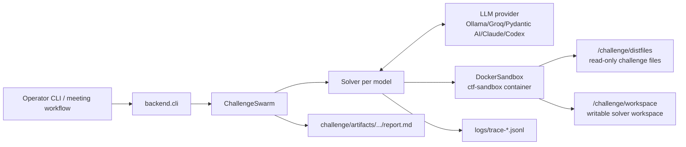
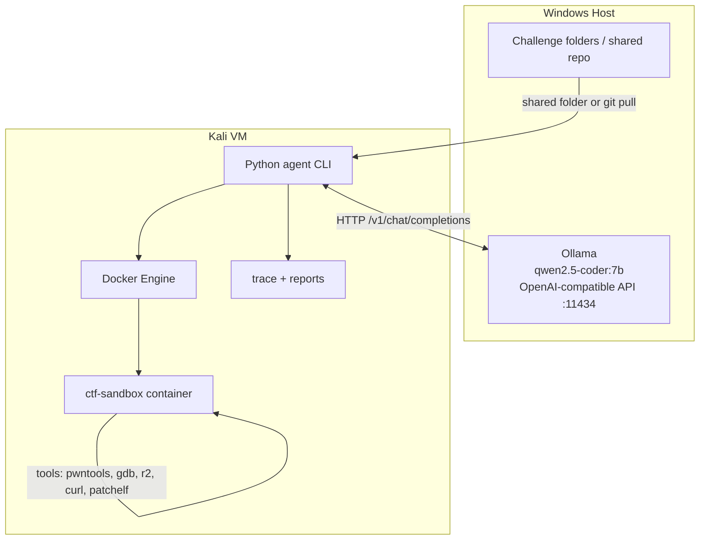

# CTF Agent Architecture Summary

This project is a multi-model CTF solving system. The agent process runs on the operator machine, talks to one or more LLM providers, starts one Docker sandbox per solver, exposes sandbox tools to the model, records every action, and exports a solve report plus generated exploit files.

## Process Layout



## Main Entry Points

- `backend/cli.py`: Click CLI. Handles local challenge mode, smoke recon mode, and full coordinator mode.
- `backend/config.py`: Settings loaded from `.env` and environment variables.
- `backend/models.py`: Maps model specs like `ollama/qwen2.5-coder:7b` or `groq/...` to provider clients and model settings.
- `backend/agents/swarm.py`: Runs a group of solvers on one challenge and cancels siblings once a flag is confirmed.
- `backend/agents/solver.py`: Main per-model solving loop.
- `backend/sandbox.py`: Docker lifecycle and command/file execution.
- `backend/artifacts.py`: Copies workspace, trace, and writes `report.md`.

## Local Challenge Flow

1. Operator runs:

   ```bash
   ctf-solve --challenge mychalls/foo --models ollama/qwen2.5-coder:7b
   ```

2. `backend.cli` loads `metadata.yml`, creates a `CTFdClient`, `CostTracker`, and `ChallengeSwarm`.

3. `ChallengeSwarm` creates one solver per model.

4. Each solver starts one Docker container from `ctf-sandbox`.

5. The challenge folder is mounted into the container:

   - Host challenge `distfiles/` -> container `/challenge/distfiles` as read-only.
   - Temporary host workspace -> container `/challenge/workspace` as read-write.
   - `metadata.yml` -> container `/challenge/metadata.yml` as read-only.

6. The model receives a system prompt describing the challenge and available tools.

7. The solver executes model actions against the sandbox.

8. Every tool call, tool result, model response, token usage, and finish event is written to JSONL trace.

9. At the end, `backend.artifacts.export_solver_artifacts()` copies the workspace and trace into:

   ```text
   challenge/artifacts/<timestamp>-<model>/
     workspace/
     trace.jsonl
     report.md
   ```

## Sandbox Tool Execution

The LLM never directly controls the host shell. It only gets tool wrappers.

For Pydantic AI-compatible providers, tools come from `backend.tools.sandbox`:

- `bash(command, timeout_seconds)`
- `read_file(path)`
- `write_file(path, content)`
- `list_files(path)`
- `web_fetch(url, method, body)`
- `webhook_create()`
- `webhook_get_requests(uuid)`
- `check_findings()`
- `notify_coordinator(message)`
- `view_image(filename)` for vision-capable models
- `submit_flag(flag)` when not in dry-run mode

Those wrappers call provider-independent logic in `backend.tools.core`, which calls `DockerSandbox`.

`DockerSandbox.exec()` runs:

```bash
timeout --signal=KILL --kill-after=5 <seconds> bash -c '<command>'
```

inside the container using Docker exec. Output is captured, truncated, traced, and sent back to the model.

## Local Ollama / Host Windows Model Flow

For local models such as Qwen through Ollama, the repo uses an OpenAI-compatible HTTP endpoint:

```text
Kali VM or agent process -> http://host.docker.internal:11434/v1 or http://<Windows-host-ip>:11434/v1 -> Ollama on Windows
```

In this repo, `Settings.ollama_base_url` defaults to:

```text
http://localhost:11434/v1
```

For a Kali VM agent talking to Windows-host Ollama, set:

```env
OLLAMA_BASE_URL=http://<windows-host-ip>:11434/v1
OLLAMA_API_KEY=ollama
```

Or pass:

```bash
ctf-solve --ollama-base-url http://<windows-host-ip>:11434/v1 --models ollama/qwen2.5-coder:7b
```

Ollama/Groq use the text-command loop in `backend/agents/solver.py` instead of native function calling. The model must emit compact JSON actions:

```json
{"action":"bash","command":"checksec /challenge/distfiles/chall","timeout_seconds":60}
```

Supported text-loop actions:

- `bash`
- `read_file`
- `write_file`
- `list_files`
- `submit`
- `give_up`

This avoids brittle local model function-calling while still allowing all sandbox tooling.

## Kali VM + Windows Host Architecture

Recommended deployment for your next agent:



The clean boundary is:

- Kali runs the agent, Docker, CTF tools, exploit scripts, and challenge services.
- Windows runs only the model server.
- The agent talks to Windows Ollama over HTTP.
- The model never gets direct host execution; it only asks the agent to run sandbox tools.

## Binary Challenge Runtime / libc Handling

The current sandbox includes common pwn tooling and i386 support. The workflow is:

1. Run `file`, `ldd`, `checksec`, and execution smoke checks.
2. If challenge-provided `.so` files exist, run with:

   ```bash
   LD_LIBRARY_PATH=/challenge/distfiles ./chall
   ```

3. If a different loader/libc is required, download or copy matching files into:

   ```text
   /challenge/workspace/libc/
   ```

4. Patch a workspace copy, never the read-only distfile:

   ```bash
   cp /challenge/distfiles/chall /challenge/workspace/chall.patched
   patchelf --set-interpreter /challenge/workspace/libc/ld-linux-x86-64.so.2 \
            --set-rpath /challenge/workspace/libc \
            /challenge/workspace/chall.patched
   ```

5. Run exploit validation against the patched runtime.

6. Keep only useful exploit artifacts in `/challenge/workspace`; remove bulky downloads before final export if they are not needed in the report.

## Solver Workflow

`backend/agents/solver.py` is the brain of a single model run:

1. Start sandbox.
2. Build prompt with `backend.prompts.build_prompt()`.
3. For text-loop providers, run deterministic recon first.
4. Select pwn skill snippets from `ctf-pwn/`.
5. Optionally run deterministic pwn autopilot for known patterns such as format-string global writes.
6. Ask model for next JSON action.
7. Execute action in sandbox.
8. Append result to conversation.
9. Reject low-value loops, placeholder flags, malformed JSON, and early `give_up`.
10. Submit or dry-run verify candidate flag.

The most important recent workflow refinement is step 5: when recon proves a known vulnerability class, the agent should run a deterministic validator or exploit template instead of waiting for a small local model to invent the exact payload.

## Coordinator Mode

Coordinator mode is for full CTF events:

- `backend.poller.CTFdPoller` watches CTFd for new and solved challenges.
- `backend.agents.coordinator_loop` starts an event loop.
- `backend.agents.coordinator_core` exposes coordinator tools:
  - fetch challenges
  - spawn swarm
  - check status
  - read solver trace
  - bump stuck agent
  - broadcast hints
  - submit flag
  - kill swarm
- `backend.agents.codex_coordinator` drives Codex App Server through JSON-RPC dynamic tools.
- `backend.agents.claude_coordinator` does the same concept through Claude Agent SDK tools.

The coordinator does not solve directly. It manages many swarms, reads traces, and sends targeted hints.

## Artifact / Meeting Docs Pipeline

Every solver run produces three useful meeting artifacts:

- `trace.jsonl`: exact sequence of model responses, tool calls, outputs, errors, usage, and finish state.
- `workspace/`: generated scripts, exploit harnesses, temporary helpers.
- `report.md`: human-readable solve summary with hardening, suspicious lines, commands run, exploit artifacts, and status notes.

For meeting docs, the simplest pipeline is:

```text
trace.jsonl + workspace/ + metadata.yml -> report.md -> meeting summary
```

A future improvement would be a dedicated `meeting_report.md` exporter that includes:

- architecture diagram
- challenge timeline
- model mistakes
- successful tool chain
- unresolved blockers
- recommended next engineering changes

## Important Design Lessons

- Do not let the model stop at "I found the vulnerability." Force the next phase: validate primitive, write exploit, run exploit, submit.
- For local models, prefer JSON text protocol over provider-native tool calls.
- Put all challenge tooling in Docker, not on the host.
- Mount challenge files read-only and force all generated files into `/challenge/workspace`.
- Trace everything. The trace is how the coordinator, reports, and humans debug the agent.
- Build deterministic autopilots for common bug classes: format strings, ret2win, simple BOF offset finding, one-gadget/libc leak workflows, path traversal, SQLi, JWT weak secret, etc.
- Keep cache and artifact folders out of code searches and model context.
- Treat libc/loader mismatch as normal pwn workflow, not an error. Download or mount the matching runtime, patch a workspace copy, validate, then clean up.

