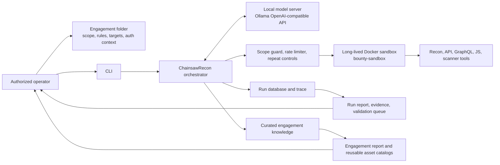
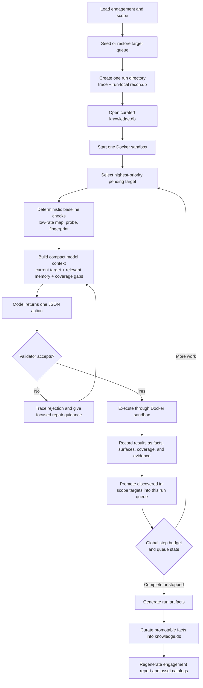
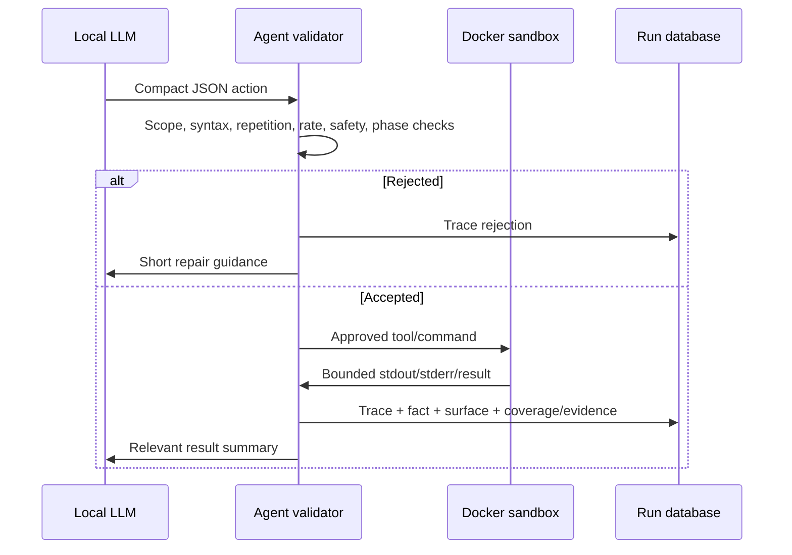
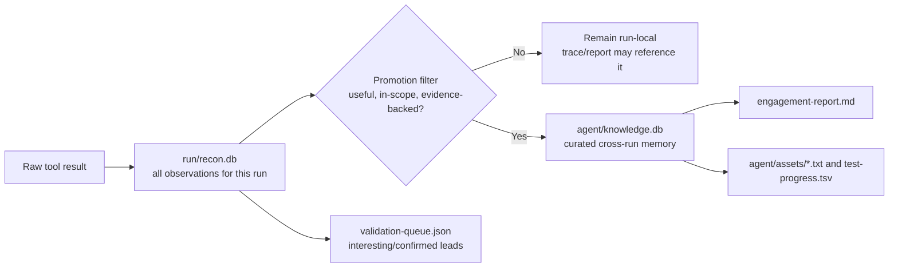

# ChainsawRecon Workflow and Architecture

## Purpose

ChainsawRecon is an engagement-first, evidence-led bug-bounty agent. Its job is not to produce a long list of generic scanner messages. Its job is to preserve the working memory a careful tester would build: what is in scope, what is alive, what technology and application surfaces exist, which checks were actually performed, what evidence supports a lead, and what should happen next.

The agent runs only within a user-provided authorized engagement. It combines a local LLM, deterministic tooling, a Docker sandbox, structured databases, a target queue, and generated reports.

## Core Design Principles

1. Engagement before target: scope files and the target queue are primary. A CLI `--target` is an optional seed, not the sole focus.
2. One run, many targets: newly discovered in-scope assets join the current run queue. They do not create unrelated standalone runs.
3. Evidence before conclusions: a tool result is an observation; a finding needs a reproducible security hypothesis and supporting response evidence.
4. Two-tier memory: raw run state is disposable; only curated, high-value facts become cross-run engagement memory.
5. Compact model context: the model sees the current target, relevant surfaces, prior coverage, and selected facts, not every URL, trace, or program line on every call.
6. Human handoff matters: compact catalogs and validation queues are first-class artifacts, not side effects of a report.
7. Safety is architectural: scope validation, rate limits, command policies, and sandboxing happen before execution, not as model instructions alone.

## System Context



### Trust Boundaries

| Component | Responsibility | Trust boundary |
|---|---|---|
| Operator | Defines authorization, scope, rate limits, credentials, and priorities | Only the operator may expand testing authority. |
| Engagement folder | Durable program-specific input and generated memory | Sensitive data must remain local and uncommitted. |
| Orchestrator | Prompt assembly, action validation, queue management, persistence, and reports | Does not trust raw model output. |
| Local LLM | Chooses the next constrained action from compact evidence | Cannot access host shell or bypass the validator. |
| Docker sandbox | Runs approved tools in a contained workspace | Receives only validated actions and scoped mounts. |
| Target systems | Authorized program assets only | Scope guard and program rules decide whether an action is permitted. |

## Engagement Layout

```text
engagements/<program>/
  program/
    scope.json              Machine-readable scope, limits, and allowed hosts
    in-scope.txt            Optional seed assets and endpoints
    out-of-scope.txt        Explicit exclusions
    rules.md                Human-readable program restrictions
    prompt.md               Concise testing context for the model
    secrets.env             Optional local auth data; never commit
    priority-targets.txt    Optional deep-test list
  manual/
    notes.md                Human observations
    findings.md             Human-managed finding notes
    report-drafts.md        Draft submissions
  agent/
    knowledge.db            Curated cross-run memory
    engagement-report.md    Consolidated human-readable target picture
    assets/                 Reusable inventories and coverage data
    runs/                   Immutable per-run artifacts
```

`scope.json`, rules, and operator direction always override model suggestions. The agent should decline or defer actions that do not satisfy them.

## Run Lifecycle



The entire queue shares one global `--max-steps` budget. This prevents a target switch from silently resetting the overall limit. As budget gets low, scheduling should favor an existing high-value hypothesis, coverage completion for a priority surface, artifact completion, and reporting over broad new discovery.

## Phases and Decision Model

### Mapping

Mapping builds the minimal, durable picture needed to work safely and efficiently:

- In-scope roots, hosts, and endpoint seeds.
- DNS/HTTP reachability and technology hints.
- API, GraphQL, JavaScript, source-map, documentation/SDK, and authentication surfaces.
- Candidate target queue entries with source and priority.

Mapping is intentionally structured and low rate. It writes a durable `mapping-state.json` that later phases can reuse.

### Recon

Recon turns a mapped surface into actionable test context:

- Probe live services and identify frameworks, CDN/WAF behavior, and response baselines.
- Extract route, API, GraphQL, parameter, bundle, and source-map clues.
- Compare authentication state only when supplied context is valid.
- Use specialized local tools where surface evidence justifies them.
- Persist coverage: a surface should record which attack families and auth contexts were attempted.

### Attack

Attack is not indiscriminate scanning. It begins with the existing map and recon record, then chooses a focused validation family appropriate to the surface: for example authorization behavior for a tenant-scoped API, input handling for a parameterized route, or schema/documentation analysis for GraphQL.

An attack result is classified as a signal, hypothesis, reproduced issue, validated issue, rejected result, or blocked/deferred surface. Only validated, evidence-supported findings should appear as confirmed vulnerabilities.

### Assistant

Assistant mode is operator-led. It is deliberately separate from autonomous testing modes. It can help an operator reason about results and, when explicitly asked, perform a focused Google search and return selected sources. Public search/GitHub research is disabled in mapping, recon, attack, and auto modes so low-quality search results do not pollute context or engagement memory.

## Target Queue and Priorities

Every in-scope seed should be eligible for the queue. A target is promoted when it is in scope and has evidence that makes it useful to pursue: a live host, a discovered endpoint, an API/GraphQL route, a JavaScript-derived surface, an auth-sensitive path, or an operator priority entry.

The queue does not mean every URL gets equal effort. Scheduling order is shaped by:

1. Operator `priority-targets.txt` entries.
2. Authentication, tenant, API, GraphQL, JavaScript, source-map, and documented SDK surfaces.
3. High-confidence live assets and evidence-bearing endpoints.
4. Untested coverage combinations that are relevant to a surface.
5. Broad lower-signal discovery results.

Duplicate canonical targets are rejected. Queue state and completed targets are written into the run state so a later run can understand what was already covered.

## Model Context and Token Discipline

The LLM does not need a full trace or every asset on each turn. The orchestrator should supply a bounded context containing:

- Current phase, current queue target, remaining global step budget, and queue size.
- The applicable compact program rules and scope summary.
- A small set of relevant engagement facts and surfaces.
- Current target’s known routes, technologies, auth context, and recent tool observations.
- Coverage gaps and validation tasks that are actionable now.
- The strict JSON action protocol and tool availability.

Older raw tool output is condensed or retrieved on demand. Full traces remain on disk for audit but are not prompt material. This avoids prompt truncation and prevents a model from repeatedly reacting to stale, low-value content.

## Action and Validation Loop

The local model returns exactly one compact action, such as a tool call, a safe shell command, artifact read/write, finding record, or finish request. The orchestrator validates it before execution.



The validator controls malformed requests, repeated commands, unsupported tools, unsafe commands, invalid scopes, empty/truncated scripts, and premature finish attempts. It should not reduce legitimate deep work merely because a target is difficult; it should require concrete mapping/recon/validation coverage before accepting a finish.

## Sandbox

The `bounty-sandbox` Docker image is built from `sandbox/Dockerfile.sandbox`. The agent creates one long-lived container per run, using a writable workspace for generated scripts and evidence. The model interacts through constrained tool wrappers; it does not receive direct host command access.

Included tool families:

- Discovery and mapping: `httpx`, `katana`, `subfinder`, `assetfinder`, `dnsx`, `naabu`, `gau`, `waybackurls`, `ffuf`, `feroxbuster`, `gobuster`, `dirsearch`.
- Fingerprinting and scanners: `nuclei`, `whatweb`, `wafw00f`, `nikto`, `nmap`.
- API and GraphQL: `inql`, `clairvoyance`, `grapeql`, `arjun`, `graphql-cop`, `curl`, Python requests.
- Validation and analysis: `sqlmap`, `dalfox`, `xsstrike`, `commix`, `trufflehog`, JavaScript/source-map analysis helpers.

Tool capability should remain evidence-led. For example, GraphQL tooling is useful after a GraphQL endpoint is observed; it should not be blindly fired at every host.

## Data Model: Run State Versus Engagement Memory



The run database can safely hold tentative, incomplete, or failed observations because it is a snapshot of a single run. The engagement database is a conservative memory store. Public-search queries are excluded from promotion. This separation prevents one poor model decision from permanently contaminating future runs.

## Human-Facing Artifacts

### Per-run

- `trace.jsonl`: audit log; preserve it unchanged.
- `session.state.json`: current phase, queue, global steps, stop status, and artifact locations.
- `mapping-state.json`: reusable structured mapping output.
- `report.md`: concise narrative for what happened this run.
- `validation-queue.json`: machine-readable list of leads needing reproduction or stronger proof.
- `priority-followups.md`, `interesting-leads.md`, `auth-surfaces.md`: compact operator handoff files.
- `workspace/`: only useful evidence and valid scripts should survive; empty or truncated artifacts are rejected.

### Engagement-wide

- `knowledge.db`: curated facts, surfaces, tested combinations, and attack results.
- `engagement-report.md`: a deduplicated overview of the target’s layout, technologies, live surfaces, APIs, auth areas, coverage, and active leads.
- `assets/*.txt`: practical manual-testing inventories such as live hosts, URLs, API routes, GraphQL endpoints, JS bundles, source maps, documentation/SDK targets, and auth surfaces.
- `test-progress.tsv`: maps stable surface IDs to attack family, auth context, outcome, and source so a human or later run can resume deliberately.

## Authentication Workflow

Authentication is operator-controlled. The preferred flow is:

1. The operator obtains a valid test-account session through the permitted application flow.
2. Minimal necessary cookies, headers, or tokens are placed in a local, uncommitted secrets or Docker env file.
3. The agent uses that context only against in-scope assets and can compare guest and authenticated behavior.
4. Observed endpoints, redirects, cookie domains, session refresh behavior, and authorization-sensitive routes are recorded as surfaces.
5. The agent does not persist raw credentials into reports, normal prompts, or public artifacts.

Fully autonomous credential login is intentionally not assumed: SSO, MFA, device binding, anti-bot systems, and program rules make it unsafe and unreliable. Browser/HAR-assisted operator capture is a sensible future addition for replayable authorized requests.

## WAF and Cloudflare Behavior

WAF or Cloudflare responses are context, not a challenge to defeat. The correct adaptive behavior is to:

- Capture status, headers, and block evidence.
- Reduce request rate and concurrency within program rules.
- Avoid repetitive retries that add no evidence.
- Mark the surface blocked or deferred in coverage state.
- Continue with other authorized surfaces or request an operator-provided authenticated/browser-derived request when appropriate.

The agent should never attempt to evade protections, rotate identity, or bypass access controls.

## Reporting and Finding Quality

Reports should be deduplicated and decision-oriented. A good report says what surface was observed, what was tested, the exact result/evidence path, the confidence level, what remains untested, and the next smallest validation step.

It should not repeat every URL, include raw search noise, treat a version banner as a vulnerability by itself, or call an unverified scanner result a confirmed bug.

Useful finding states:

| State | Meaning | Required next step |
|---|---|---|
| Signal | Something unusual was observed | Determine whether it has security impact. |
| Hypothesis | A plausible vulnerability theory exists | Run one focused, authorized validation. |
| Reproduced | Behavior can be repeated | Establish impact and affected authorization context. |
| Validated | Reproducible security impact with evidence | Prepare a program-quality report. |
| Rejected | Expected or non-security behavior | Record briefly to prevent duplicate work. |
| Blocked/deferred | Insufficient authorization, WAF, outage, or rule constraint | Preserve context and return later. |

## Current Improvement Opportunities

The architecture deliberately leaves room for higher-value improvements:

1. HAR/proxy import: ingest an operator-provided browser capture into a normalized request catalog, then derive auth surfaces and safe replay templates.
2. Request/response normalization: store canonical request fingerprints, parameter schemas, response hashes, and differential comparisons instead of raw text blobs.
3. Better auth state modeling: explicitly track guest, authenticated-user, tenant-A, tenant-B, expired-session, and privileged roles where program authorization permits them.
4. Hypothesis graph: link a potential weakness to required prerequisites, evidence nodes, related endpoints, and attempted validations; this makes chaining deliberate rather than speculative.
5. Task-value scheduling: score pending work from surface sensitivity, novelty, coverage gap, evidence confidence, cost, and remaining budget.
6. Deterministic validators: for repeatable low-risk checks, generate structured probes from observed API schemas and parameter types rather than relying on the model to improvise every request.
7. Artifact contracts: make evidence files require command, timestamp, request, sanitized response metadata, interpretation, and reproduction status.
8. Model evaluation harness: replay fixed, sanitized run snapshots against candidate models and measure malformed actions, duplicate commands, coverage completion, evidence quality, and premature finish rate.
9. Snapshot and rollback controls: retain versioned engagement-memory snapshots so erroneous promotion can be reviewed or reverted without touching raw run data.
10. Program-rule compiler: convert common rule constraints into explicit machine checks, such as prohibited endpoints, request ceilings, authentication restrictions, and required headers.

## Build and Operation Reference

Rebuild the sandbox when its Dockerfile changes:

```powershell
docker build --pull --no-cache -f sandbox/Dockerfile.sandbox -t bounty-sandbox:latest .
```

Run an authorized engagement without supplying a single `--target` seed:

```powershell
python -m bounty_agent.cli `
  --engagement engagements\<engagement-name> `
  --mode attack `
  --provider ollama `
  --model ollama/chrisdiochavez/ANINOGPT-PILIPINAS-ATAKE:latestv3 `
  --llm-base-url http://localhost:11434/v1 `
  --llm-api-key ollama `
  --runner docker `
  --docker-image bounty-sandbox `
  --execute `
  --max-steps 1500 `
  --max-commands-per-minute 40
```

Use `--dry-run` rather than `--execute` when you want to inspect planning and validation behavior without issuing commands.

## Diagram Prompt Seed

For a high-level public architecture diagram, preserve this relationship:

```text
Operator-defined engagement -> CLI/orchestrator -> local Ollama model
Local model -> constrained JSON action -> scope/safety validator -> Docker sandbox tools
Docker results -> run trace + run database -> curated engagement knowledge
Curated knowledge -> consolidated report + reusable asset catalogs -> operator and next run
```

For a workflow diagram, show mapping -> recon -> attack as evidence-led phases within one shared run and target queue, with run-local memory promoted conservatively into engagement-wide memory after the run.
